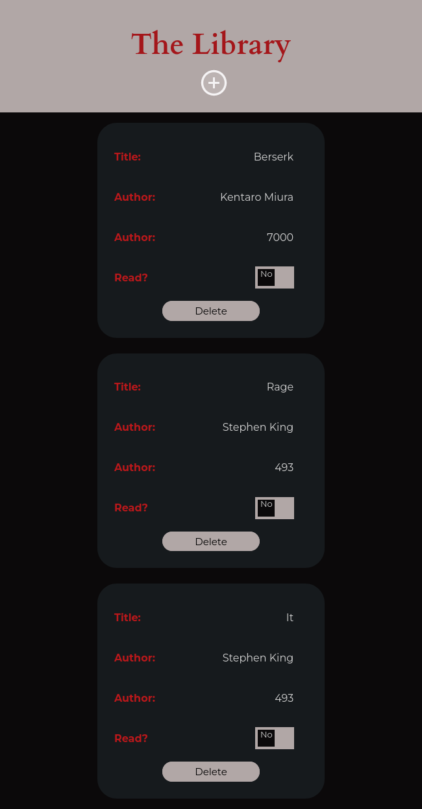
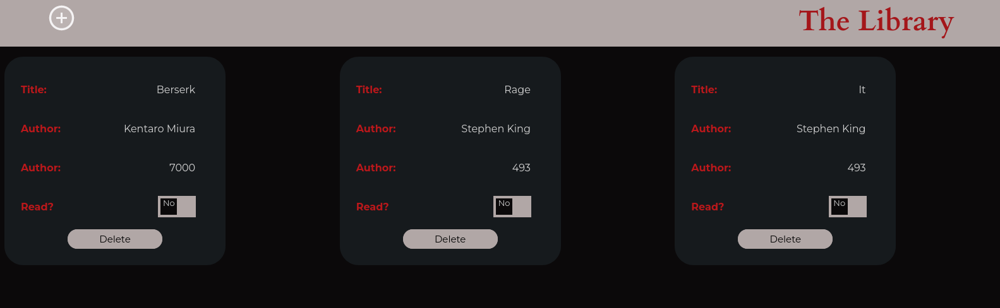

# The Odin Project - Library App


## Table of contents

- [Overview](#overview)
  - [Screenshot](#screenshot)
  - [Links](#links)
- [My process](#my-process)
  - [Built with](#built-with)
  - [What I learned](#what-i-learned)
  - [Continued development](#continued-development)
  - [Useful resources](#useful-resources)
- [Author](#author)
- [Acknowledgments](#acknowledgments)

## Overview

### Screenshot





### Links

- Solution URL: [Source Code](https://github.com/AlexdelCarmen/library-app-top)
- Live Site URL: [Live Page](https://alexdelcarmen.github.io/library-app-top/)

## My process

i approached this progressively, first coded the HTML skeleton, then moved on to style mock up book cards to ensure they looked OK, next I styled the input form modal, next I started adding functions, first the function to bring up and close the input modal, next I included the one to add book objects to the library array, then I added functionality to convert each array element into a DOM element in the page, and lastly I added the button on each card to delete a chosen entry.
### Built with

- Semantic HTML5 markup
- CSS custom properties
- Flexbox
- Grid layout
- Mobile-first workflow
- Vanilla JavaScript


### What I learned

Objects and some tricks to modify the DOM that I didn't do before, I really liked the way I managed to handle the delete option.  

```js
deleteButtons = document.querySelectorAll(".delete-book");

  deleteButtons.forEach((button) =>
    button.addEventListener("click", () => {
      let divCardId = button.parentNode.parentNode.id;
      divToDelete = document.getElementById(divCardId);
      divToDelete.remove();
      bookCollection.splice(divCardId, 1);
      let bookCards = document.querySelectorAll(".book-card");
      let i = 0;
      bookCards.forEach((card) => {
        card.id = i;
        i++;
      });
    })
  );

```

### Continued development

Creating several DOM elements, I am not being efficient at this, you can tell by the massive wall of code I made to just create one card with book information. 

### Useful resources

- [W3Schools](https://www.w3schools.com/) - DOM manipulation tips, especially how to get the parent from a DOM element.

## Author

- Website - [Github Profile](https://github.com/AlexdelCarmen)
- Frontend Mentor - [@AlexdelCarmen](https://www.frontendmentor.io/profile/AlexdelCarmen)
- Twitter - [@AlekBorchov](https://twitter.com/AlekBorchov)

## Acknowledgments

To July, you don't care about this kiddo, but I think of you every line of code I write, this one's for us.
